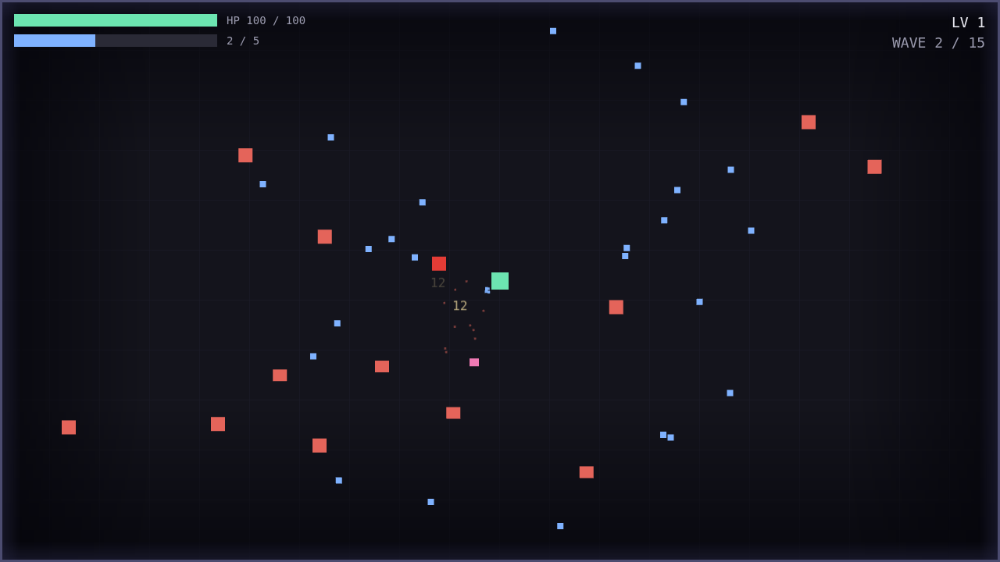
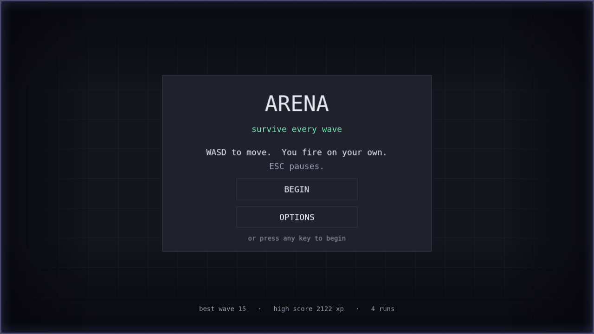
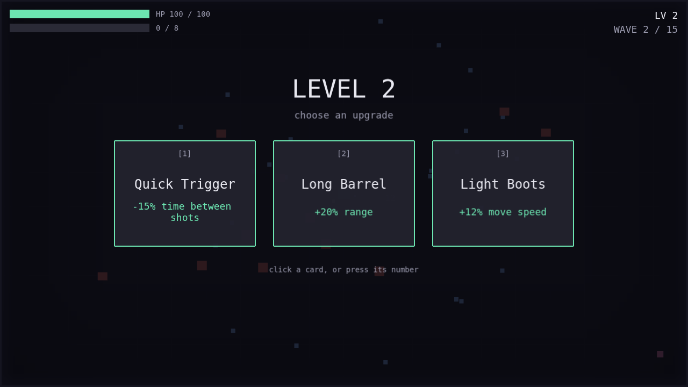

# arena

A 2D top-down arena survivor — you stand in a box, enemies walk at you in waves, your weapon
fires itself, and you live as long as you can. Fifteen waves, and then you win. Built with
**Phaser 4** and **TypeScript**, with **no art assets and no audio files**: every frame is
drawn into a texture at boot and every sound is synthesised into a buffer at boot.

It is also a deliberate architecture exercise, built in three stages, where the discipline of
*not* building ahead of the current stage is the point. **All three stages are complete.**



## Quick start

Requires **Node 20.19+ or 22.12+** (a Vite 8 constraint).

```bash
npm install
npm run dev          # http://localhost:5173
```

**WASD** to move. You fire automatically at whatever is nearest. **ESC** pauses. That is the
whole control scheme — everything else is on the menu.

| Command | What it does |
|---|---|
| `npm run dev` | Dev server with hot reload |
| `npm run build` | Production build into `dist/` |
| `npm run preview` | Serve the production build |
| `npm run typecheck` | `tsc --noEmit` |
| `npm run lint` | ESLint, zero warnings tolerated |
| `npm run test` | Vitest |

The last four are the definition of done. A change is not finished until all four pass.

## Deployment

**Not deployed** — a deliberate decision by the project's owner, not a gap in readiness. The
build is deploy-ready: `npm run build` emits static files, there is no backend, no environment
variable and no server-side anything.

[`docs/version3/deployment.md`](docs/version3/deployment.md) is the runbook — what each of the
four candidate hosts needs, the one real trap (GitHub Pages serves from a subpath and Vite's
default `base` breaks there), what to check after a deploy, and how to roll back.

<table>
<tr>
<td width="50%"></td>
<td width="50%"></td>
</tr>
</table>

## Documentation

Read these in order depending on who you are.

| If you are… | Start here | Why |
|---|---|---|
| **New to game development** (but a working developer) | [`docs/ONBOARDING.md`](docs/ONBOARDING.md) | Translates game-engine concepts into terms a web developer already has. Assumes you know TypeScript and npm, assumes you have never written a game loop. |
| **Wanting the current state** | [`docs/STATUS.md`](docs/STATUS.md) | The checkpoint. What works, what is deliberately missing, what is known-broken, and what was never built and why. |
| **Ready to change code** | [`ARCHITECTURE.md`](ARCHITECTURE.md) | How the parts fit, the event catalogue, and which file to touch for a given change. |
| **An AI agent picking up work** | [`docs/STATUS.md`](docs/STATUS.md) §5 → [`AGENTS.md`](AGENTS.md) | STATUS tells you where things stand and which traps this project has already fallen into; AGENTS is the authority on the twenty invariants that will get work rejected if broken. |
| **Curious how it was built** | [`docs/version1/`](docs/version1/README.md) → [`version2/`](docs/version2/README.md) → [`version3/`](docs/version3/README.md) | The development record, one folder per stage: what was decided and why, what went wrong, and what a developer new to 2D games should take from it. |

**The stage briefs** are [`docs/STAGE_2_INSTRUCTIONS.md`](docs/STAGE_2_INSTRUCTIONS.md) and
[`docs/STAGE_3_instructions.md`](docs/STAGE_3_instructions.md), both historical now that both
stages have landed. [`docs/KICKSTART.md`](docs/KICKSTART.md) is the original Stage 1 prompt,
kept as history. [`CLAUDE.md`](CLAUDE.md) covers working conventions rather than the code.

Version 1 is the best entry point if you want to understand *why* the project looks like this
rather than *how* it works today.

## The shape of it

66 TypeScript files, ~5,900 lines excluding tests, no art assets, and no runtime dependency
beyond Phaser and zod — across all three stages.

```
src/
├─ core/         portable TypeScript — zero Phaser imports, lint-enforced
├─ components/   reusable behaviour attached to entities (health, weapon, input)
├─ entities/     the things on screen (player, enemy, projectile, gem, pickup)
├─ systems/      per-frame logic across many entities
├─ scenes/       lifecycle and wiring
├─ ui/           reusable widgets — panels, labels, buttons, bars
├─ platform/     browser APIs that are not Phaser's (localStorage, live settings)
├─ constants/    every tunable number and every colour in the game
└─ data/         JSON content + its zod schemas
```

Each folder has exactly one job, and a file in the wrong folder is a bug even when it
compiles. [`docs/ONBOARDING.md`](docs/ONBOARDING.md) explains what each one means and why the
boundaries are drawn where they are.

### What the exercise was actually testing

The invariants are the interesting part, and three of them cost real effort and paid for
themselves:

- **`src/core/` never imports Phaser.** Everything tricky — the stat block, the XP curve, the
  save store, the audio synthesis, the colour maths — is unit-tested in bare Node with no DOM
  shim.
- **Presentation is event-driven and one-directional.** Deleting `AudioSystem` and `VfxSystem`
  leaves a fully playable, silent, unadorned game with identical timing.
- **Zero magic numbers, colours included.** Which is why a colourblind palette was an
  afternoon's edit rather than a sweep through every file.

And one measurement worth more than any of them: at 220 enemies the game runs at **59.9 fps
with 6.4 draw calls a frame**, and the three optimisations everyone assumes a game like this
needs were measured and *declined*. The numbers and the method are in
[`AGENTS.md`](AGENTS.md#performance-budgets).
