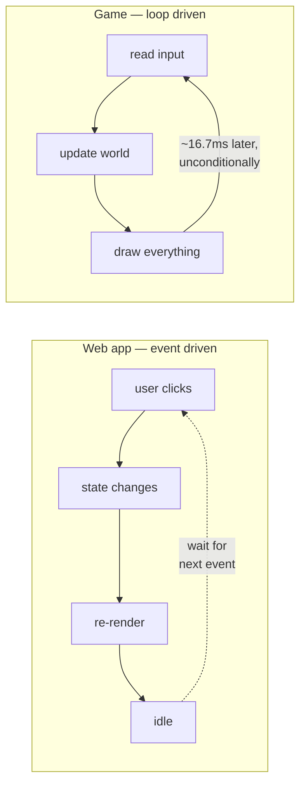
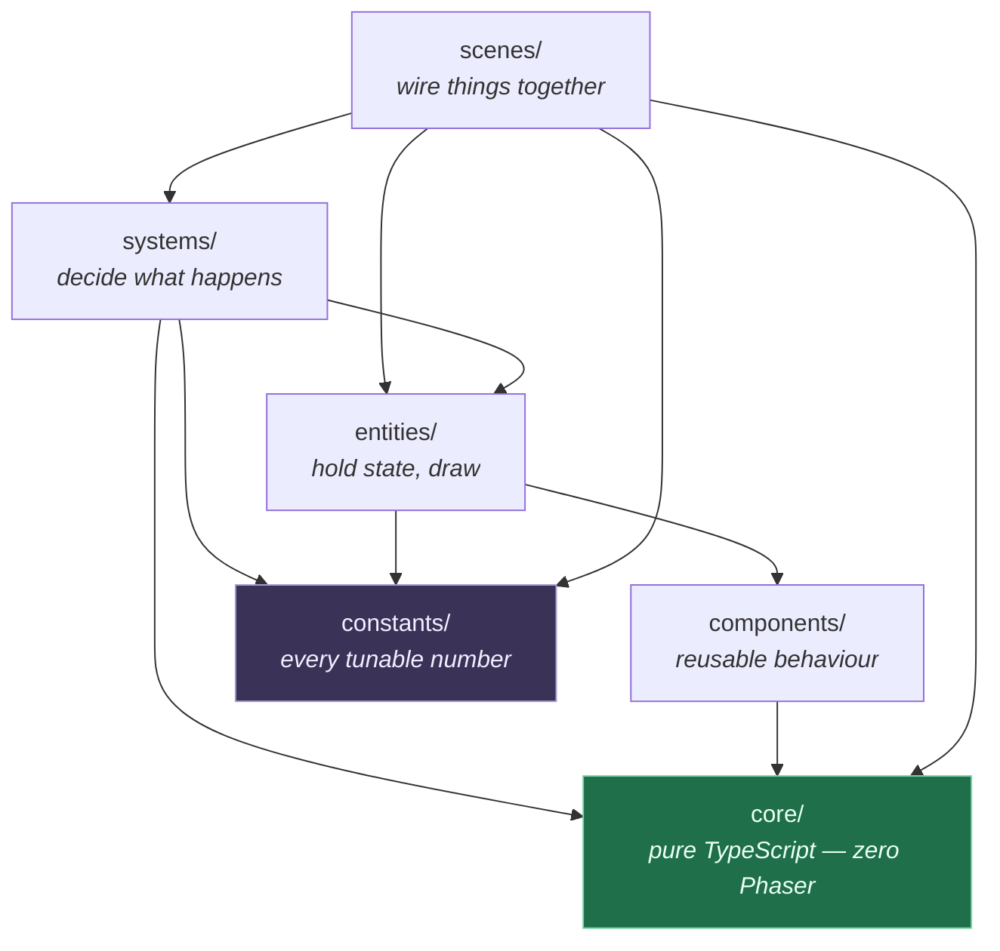
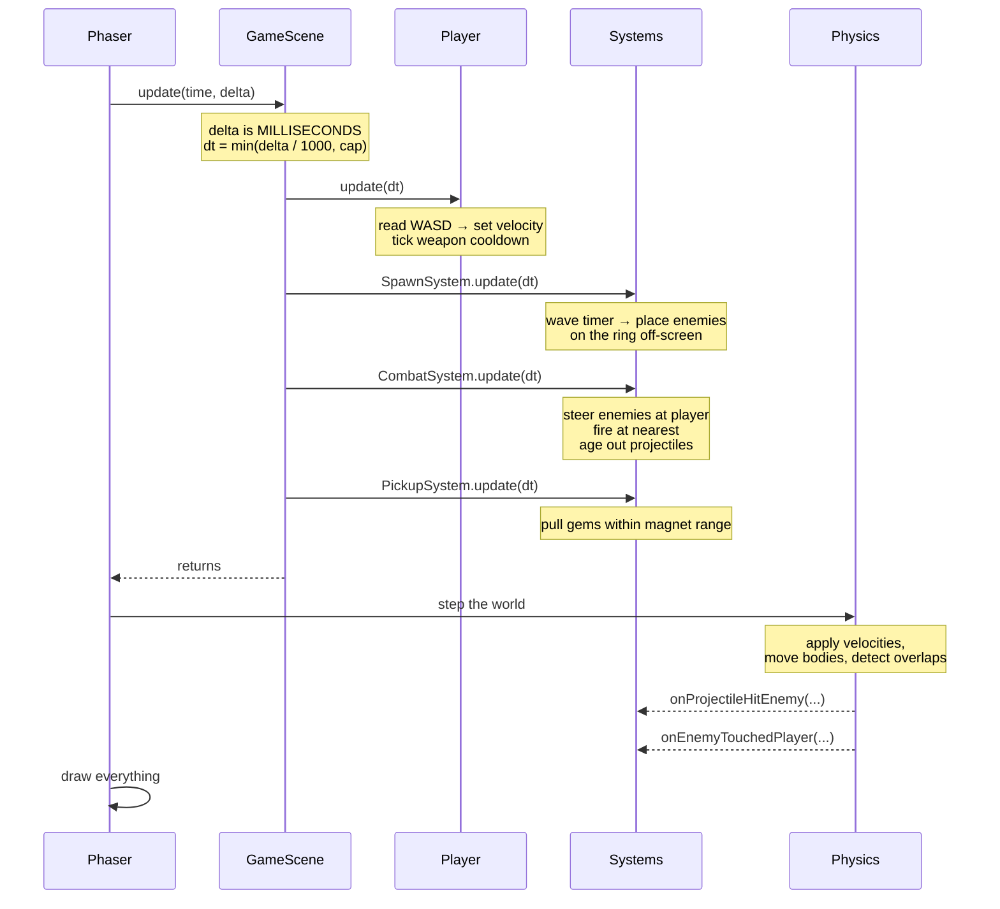
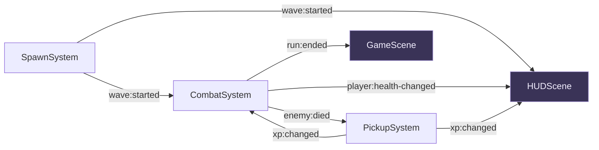
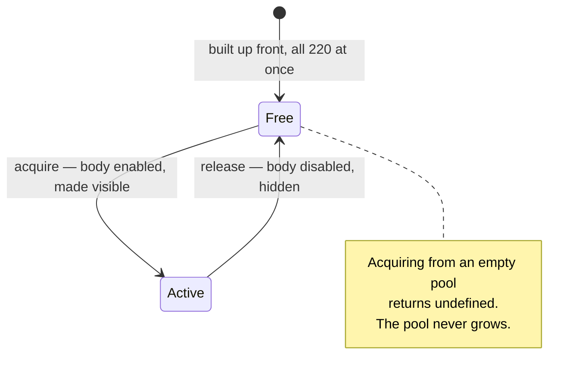

# Onboarding — for the web developer who has never built a game

You know TypeScript, npm, modules, and how to reason about an application's state. You have
probably never written a game loop, and nothing in a React or Express codebase prepares you
for one. This document closes that gap.

It does not teach TypeScript and it does not repeat the rules in [`AGENTS.md`](../AGENTS.md).
It explains the *shape* of the thing so the rules make sense when you read them.

**Contents**

1. [What transfers, and what doesn't](#1-what-transfers-and-what-doesnt)
2. [The vocabulary](#2-the-vocabulary)
3. [The layers](#3-the-layers)
4. [The folders](#4-the-folders)
5. [What happens in one frame](#5-what-happens-in-one-frame)
6. [How the pieces talk](#6-how-the-pieces-talk)
7. [Object pools, and why `new` in a loop is a bug](#7-object-pools-and-why-new-in-a-loop-is-a-bug)
8. [Delta time](#8-delta-time)
9. [Reading the code in the right order](#9-reading-the-code-in-the-right-order)
10. [Your first three changes](#10-your-first-three-changes)
11. [Traps](#11-traps)

---

## 1. What transfers, and what doesn't

The single biggest shift: **a web app reacts, a game ticks.**

A React app sits idle until something happens — a click, a fetch resolving, a timer. Then it
re-renders. A game does not wait for anything. It runs a function 60 times a second, forever,
whether or not anything changed, and every frame it must finish its work in under **16.7
milliseconds** or the player sees a stutter.

That one difference cascades into everything else.

| You know | Here | Why it's different |
|---|---|---|
| Re-render when state changes | `update(dt)` runs every frame regardless | There is no "nothing happened" — enemies are always moving |
| Immutable state, new objects each update | Mutate objects in place, reuse them | Allocating 200 objects per frame makes the garbage collector pause, and a pause is a visible stutter |
| The virtual DOM diffs for you | You decide what changes, explicitly | Nothing is watching your state. If you don't move it, it doesn't move |
| `useEffect` cleanup on unmount | `SHUTDOWN` handler on scene teardown | **Exactly the same bug class.** A listener that outlives its scene fires twice on the next run |
| Express middleware, in order | The system array, in order | Both are ordered pipelines where position matters |
| Mongoose schema validating a document | zod schema validating `waves.json` | Same idea, same reason: reject bad data at the boundary, loudly |
| Components own local state | Entities own their state, systems own the rules | Explained in [§3](#3-the-layers) |

What transfers unchanged: modules and imports, `npm run` scripts, strict TypeScript, unit
tests with Vitest, and the instinct that a file doing two jobs should be two files.



---

## 2. The vocabulary

Game engines have their own words. Most map onto something you already know.

| Word | What it actually is | Closest thing you know |
|---|---|---|
| **Scene** | A self-contained screen with its own lifecycle and objects | A route/page component with mount and unmount |
| **Game object** | Anything the engine tracks and can draw | A DOM node, roughly |
| **Sprite** | A game object that draws a picture at a position | An `` you position absolutely |
| **Texture** | The picture itself, loaded into the GPU once and reused | The decoded image behind an `` |
| **Entity** | *Our* word: a sprite plus the state that belongs to it | A model instance that also knows how to render |
| **Component** | *Our* word: a reusable piece of behaviour an entity owns | A small class you compose in, not a React component |
| **System** | *Our* word: logic that runs over many entities each frame | A service that operates on a collection |
| **Physics body** | The invisible box the engine uses for movement and collision | No web equivalent — think of a hitbox |
| **Body vs sprite** | The sprite is what you see; the body is what collides | Like separating layout from hit-testing |
| **Pool** | A pre-built set of reusable objects | A connection pool, exactly |
| **Delta time (`dt`)** | Seconds elapsed since the previous frame | The one number that makes motion frame-rate independent |
| **Arcade Physics** | Phaser's simple, fast, box-based physics | Not a real physics engine — no ragdolls, no slopes |

> **Component means two different things.** In React, a component renders UI. Here, a
> component is a plain class an entity *owns* — `Health`, `Weapon`, `Controls`. It renders
> nothing. It has no lifecycle. The overlap in the name is unfortunate and universal.

---

## 3. The layers

Every folder sits at a level, and **imports only ever flow downward**. This is the single
structural rule that keeps the project from turning into mud.



Read it as a sentence: **scenes wire, systems think, entities hold state.**

- A **scene** creates things and connects them. It decides no game rules.
- A **system** decides. It reads entity state, does the maths, writes entity state. It never
  draws and never touches the renderer.
- An **entity** holds its own state and knows nothing about the world around it. An enemy has
  no idea where the player is — a system tells it where to go.

The bottom layer, `core/`, is the interesting one: **it may not import Phaser at all.** That
is enforced by an ESLint rule, not by good intentions. Everything in `core/` is portable
TypeScript that runs in a plain Node test with no browser, no canvas, no engine.

Why bother? Because it makes the trickiest logic — the object pool, the event bus, the vector
maths — testable in milliseconds without booting a game. That is why 50 unit tests run in
under a quarter of a second.

---

## 4. The folders

| Folder | Its one job | What lives there |
|---|---|---|
| `src/core/` | Portable utilities. **No Phaser.** | `EventBus`, `ObjectPool`, `math` |
| `src/components/` | Reusable behaviour an entity owns | `Health`, `Weapon`, `Controls` |
| `src/entities/` | The things on screen | `Player`, `Enemy`, `Projectile`, `XpGem` |
| `src/systems/` | Per-frame logic across many entities | `SpawnSystem`, `CombatSystem`, `PickupSystem` |
| `src/scenes/` | Lifecycle, wiring, transitions | 6 scenes, `GameScene` being the hub |
| `src/constants/` | Keys, tunables, draw order | `keys.ts`, `balance.ts`, `depths.ts` |
| `src/data/` | JSON content and its zod schemas | `waves.json`, `schema.ts` |
| `src/__tests__/` | Vitest specs for `core/` and `components/` only | 5 files, 50 tests |

Two rules that will surprise you, both from [`AGENTS.md`](../AGENTS.md):

**Every number lives in `constants/balance.ts`.** Speeds, hit points, damage, cooldowns, spawn
rates, radii, colours — all of it. If you type a number into a system or an entity, you are in
the wrong file. This is not style: it means you can rebalance the entire game from one screen
without reading any logic.

**Content is data, not code.** Wave definitions live in `src/data/waves.json` and are
validated by a zod schema at boot. Not a hardcoded array. If the JSON is malformed the game
crashes immediately and visibly, rather than producing an empty wave seven minutes in.

---

## 5. What happens in one frame

Sixty times a second, this happens. Nothing else does.



Three things worth noticing.

**Nothing sets positions directly.** Code sets *velocity*; the physics step turns velocity
into movement. This is why most systems don't need `dt` in their own maths — the engine
already applied it.

**Collision callbacks run after your update, not during it.** By the time
`onProjectileHitEnemy` fires, every system has already finished. This is why those handlers
guard on `active` — an earlier collision in the same step may already have released the
sprite back to its pool.

**`GameScene.update()` does three things and no more:** convert time, tick the player, loop
the systems. Any game rule appearing in that method is a design failure.

---

## 6. How the pieces talk

Two objects that don't own each other never hold references to each other. They use a typed
event bus instead.



The rule that makes this worth doing: **`HUDScene` must never hold a reference to `Player`.**
The HUD draws a health bar without knowing that a player exists. It receives two numbers and
draws a rectangle. That means you can delete the HUD entirely and the game still runs, and you
can add a second thing that cares about health without touching the code that emits it.

Event payloads are **primitive values only** — numbers and strings, never entities. Partly for
decoupling, but mostly because `core/EventBus.ts` would otherwise have to name a type from
`entities/`, and entities import Phaser, and `core/` is not allowed to. The constraint
enforces itself through the type graph.

There is one deliberate exception. Collision callbacks call system methods **directly**, not
through the bus, because those fire per contact per frame and an event per bullet impact
would allocate in the hottest path in the game. The bus is for things that cross an ownership
boundary, not for everything.

The full catalogue of events lives in [`ARCHITECTURE.md`](../ARCHITECTURE.md) — one table, and
it is the place to look when you add one.

---

## 7. Object pools, and why `new` in a loop is a bug

In a web app, `new` is free enough to ignore. Here it is not.

JavaScript's garbage collector runs when it wants to. If you allocate 200 enemy objects a
second, it will eventually stop the world to clean them up — and a stop-the-world pause in the
middle of a frame is a visible stutter. The fix is to never allocate during play.

Every enemy, projectile and gem is built **once**, at scene creation, and then reused forever.



The consequences you will actually run into:

- **`acquire()` can return `undefined`.** When the pool is exhausted, you get nothing back and
  must handle it. Not an error — a designed limit.
- **A released object is not destroyed.** It's hidden and disabled, waiting to be reused. Its
  fields keep their old values until something resets them.
- **Releasing while iterating needs care.** `release()` swap-removes from the active list, so
  a loop that releases must walk **backwards** or it will skip elements. Where the codebase
  does this, there's a comment saying so, and a unit test pinning it.

The pool lives in `core/`, knows nothing about Phaser, and is generic over what it holds.

---

## 8. Delta time

Frames are not evenly spaced. A 144Hz monitor delivers them every 7ms; a struggling laptop
every 30ms. If you move an enemy "5 pixels per frame" it travels at wildly different speeds on
different machines.

So movement is expressed **per second** and multiplied by the fraction of a second that
actually elapsed. That fraction is `dt`.

Phaser hands you **milliseconds**. This project converts to **seconds exactly once**, in
`GameScene.update()`, and every function below that point takes seconds. Mixing the two is the
classic source of "why is everything 1000× too fast".

The conversion is also **capped**. Switch to another browser tab for thirty seconds and the
next frame's delta is 30,000ms; uncapped, every enemy would teleport across the arena and
straight through the player. The cap trades a little accuracy for never exploding.

---

## 9. Reading the code in the right order

Start at the bottom of the dependency graph, where there's no Phaser to distract you.

1. **`src/constants/balance.ts`** — the whole game as numbers. Read this first; it's a
   surprisingly complete description of what the game *is*.
2. **`src/core/ObjectPool.ts`** and its test — small, pure, and the idea the rest depends on.
3. **`src/core/EventBus.ts`** — read the `GameEvents` map at the top. That's the complete list
   of things that can happen in this game.
4. **`src/components/Health.ts`** — the simplest possible entity component.
5. **`src/entities/Enemy.ts`** — see how a sprite, a component and pooling combine.
6. **`src/systems/CombatSystem.ts`** — the densest file, and where the game actually happens.
7. **`src/scenes/GameScene.ts`** — how all of the above gets wired together.

Then read [`ARCHITECTURE.md`](../ARCHITECTURE.md), which will now make sense.

---

## 10. Your first three changes

Do these in order. Each one teaches a different boundary. Run all four checks after each.

### Change 1 — make the player faster

Open `src/constants/balance.ts`, find `player.speed`, change `210` to `400`. Run `npm run dev`.

That's the whole change. You did not touch the player, the input handling, or any system.
That's what "every number lives in balance.ts" buys you.

### Change 2 — add a sixth wave

Open `src/data/waves.json` and append an entry to the `waves` array, copying the shape of the
last one. Reload.

You changed content, not code. Now break it deliberately: set `"intervalSeconds": -1` and
reload. The game refuses to boot and the console names the exact path
`waves[5].spawns[0].intervalSeconds`. That's the zod schema in `src/data/schema.ts` doing its
job — bad content fails at boot, in front of you, instead of silently misbehaving later.

Put it back.

### Change 3 — show enemies-killed on the HUD

This one crosses layers, and it's the shape of most real features here.

1. **Declare the event.** In `src/core/EventBus.ts`, add to the `GameEvents` map:
   ```ts
   'enemies:killed-changed': [total: number];
   ```
2. **Emit it.** `CombatSystem` already knows when an enemy dies — find where it emits
   `enemy:died`, keep a counter alongside, and emit the new event too.
3. **Display it.** In `HUDScene`, add a text object, add a handler, subscribe in `create()`,
   and unsubscribe in the shutdown handler. **Do not skip the unsubscribe** — that's the
   `useEffect` cleanup rule, and skipping it means the listener survives a restart and fires
   twice on the next run.
4. **Document it.** Add a row to the event catalogue in `ARCHITECTURE.md`.

Notice what you did *not* do: give the HUD a reference to anything, or add a number outside
`balance.ts`, or edit a system that doesn't care about kills.

---

## 11. Traps

Things that will bite you specifically because your instincts come from the web.

**Don't create objects in `update()`.** No `new`, no array literals, no object literals, no
closures. Sixty times a second adds up fast. Vector maths writes into shared scratch objects
in `core/math.ts` for exactly this reason.

**Don't reach for a direct reference between unrelated objects.** The urge to give `HUDScene`
the player is strong and wrong. If two things need to talk and neither owns the other, that is
an event.

**Reset state in `create()`, not in the constructor.** Phaser builds each scene object **once**
and reuses it across restarts. A field initialiser runs a single time in the process's life. If
you set something up in the constructor and the player restarts, you get last run's value.

**Clean up in the shutdown handler.** Every listener, every system, every pool. The test is
restarting **twice** — most leak bugs are invisible after one restart and obvious after two.

**Phaser 4 is not Phaser 3.** Most tutorials and most of any AI model's training data are v3,
which is a different library. `import * as Phaser from 'phaser'` — the default export was
removed. The v3 pipeline system is gone. When unsure, read
`node_modules/phaser/skills/` (the package ships subsystem documentation for exactly this) or
`node_modules/phaser/types/`, which is the ground truth.

**Colour and size are not decoration.** They live in `balance.ts` like every other number,
because the Stage 1 art is literally coloured rectangles baked into textures at boot.

---

## Where to go next

- [`docs/STATUS.md`](STATUS.md) — what exists today and what could come next
- [`ARCHITECTURE.md`](../ARCHITECTURE.md) — the technical reference and the "which file do I
  touch" table
- [`AGENTS.md`](../AGENTS.md) — the invariants, in full, non-negotiable
