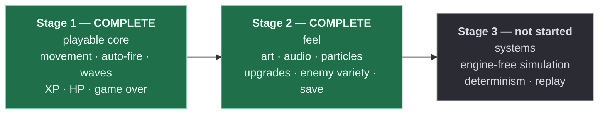

# Project status and upgrade paths

**This is the checkpoint document.** If you want to know what `arena` is today and what it
could become, read this and nothing else first. Whether you are a person returning after a
month or an agent picking up a task, start here.

| | |
|---|---|
| **Stage** | 2 of 3 — **complete**. Stage 3 not started |
| **Next** | [`STAGE_3_instructions.md`](STAGE_3_instructions.md). Its readiness gate — §9 of the Stage 2 brief — was re-checked when Stage 2 landed and all seven items hold |
| **Last verified** | 2026-08-14 |
| **Health** | `typecheck` ✅ · `lint` ✅ 0 warnings · `test` ✅ 127 passed / 9 files · `build` ✅ 0 warnings · browser console ✅ empty |
| **Size** | 42 TypeScript files |
| **Runtime dependencies** | `phaser@4.2.1`, `zod@4` — nothing else |
| **Assets** | None. Every frame is baked at boot and every sound is synthesised at boot — no images, no audio files |

> Stage 2 is done, all five passes. The per-feature ledger is
> [`STAGE_2_INSTRUCTIONS.md`](STAGE_2_INSTRUCTIONS.md) §1b.

---

## 1. What works today

Everything listed here is implemented, verified in a browser, and covered by the four checks.

| Feature | Behaviour | Owned by |
|---|---|---|
| **Movement** | WASD, normalised so diagonals aren't faster, clamped to the arena | `entities/Player.ts`, `components/Controls.ts` |
| **Auto-fire** | Targets the nearest enemy within range; holds fire when none is in range | `systems/CombatSystem.ts`, `components/Weapon.ts` |
| **Projectiles** | Pooled, travel at fixed speed, expire on a lifetime | `entities/Projectile.ts` |
| **Enemies** | Three types — grunt, swarmer, brute — as **definitions**, not classes. Walk in from a ring outside the arena, chase directly, no pathfinding | `data/enemies.json`, `entities/Enemy.ts`, `systems/CombatSystem.ts` |
| **Waves** | 10 waves, 27 spawn entries, JSON-driven with per-type and per-wave HP and speed multipliers. Holds on the final wave | `data/waves.json`, `systems/SpawnSystem.ts` |
| **Difficulty** | A real fail state. A stationary player dies in wave 3; the curve is tuned against the weapon's 37.5 dps clear rate | `data/waves.json` |
| **Damage** | Both directions. Enemy contact damage is on a per-enemy cooldown, not per frame | `systems/CombatSystem.ts`, `components/Health.ts` |
| **XP gems** | Drop on death, pulled in within magnet range, increment a counter | `systems/PickupSystem.ts`, `entities/XpGem.ts` |
| **HUD** | Health bar, wave, XP and level — in a parallel scene holding no game references | `scenes/HUDScene.ts` |
| **Animation** | Idle / walk / hit per actor. Five frames each, baked at boot; no atlas, no image files | `scenes/PreloadScene.ts`, `core/animKeys.ts`, `components/Animator.ts` |
| **Audio** | Six SFX and a two-voice music loop, all synthesised into WAV buffers at boot. Identical sounds inside 50ms coalesce | `systems/AudioSystem.ts`, `core/audioSynth.ts` |
| **VFX** | Hit sparks, death bursts, pickup sparkles, floating damage numbers, screen shake, damage flash | `systems/VfxSystem.ts`, `entities/FloatingText.ts` |
| **Game feel** | Knockback away from the shot; the whole simulation freezes 45ms on a kill | `systems/CombatSystem.ts` |
| **Progression** | XP curve, levels, pick-1-of-3 upgrades over a paused game. Six upgrades, stack-capped and weighted | `systems/ProgressionSystem.ts`, `core/xpCurve.ts`, `scenes/UpgradeScene.ts` |
| **Stats** | Immutable bases plus modifiers, recomputed on every read. Removing a modifier restores the exact base | `core/StatBlock.ts`, `components/Stats.ts` |
| **Persistence** | High score, best wave and total runs in `localStorage`, versioned and zod-validated, with a v1→v2 migration | `core/SaveStore.ts` |
| **Pause** | Escape freezes the run and layers a screen over it, still rendering | `scenes/PauseScene.ts` |
| **Run flow** | Menu → game → (level-ups, pauses) → death → summary with records → restart | `scenes/` |
| **Content validation** | `waves.json`, `enemies.json` and `upgrades.json` are zod-validated at boot; malformed content crashes immediately with the exact failing path | `data/schema.ts` |
| **Restart safety** | Two consecutive restarts behave identically to one, verified by listener census | `scenes/GameScene.ts` |

### Verified behaviours worth not regressing

These were established by measurement, not inspection. If you change the relevant code, re-check them.

- **Listener census across restarts.** Driving `run:ended` through the real path and reading
  `eventBus.listenerCount` gives an identical result every run — `wave:started` 2,
  `player:health-changed` 1, `enemy:died` 3, `xp:changed` 3, `run:ended` 1, `enemy:damaged` 2,
  `player:damaged` 2, `weapon:fired` 1, `gem:collected` 2, `level:up` 3, `upgrade:chosen` 1 —
  and all zeros between runs. Verified across two consecutive restarts on 2026-08-14. Measure it from a system's own `bus` field: importing `EventBus.ts` from
  devtools gets you a *second* module instance and a census that looks doubled.
- **A stationary player dies in wave 3**, with roughly 20 enemies alive. Measured in-browser.
- **Deleting `AudioSystem` and `VfxSystem`** from the array in `GameScene.create` leaves a
  playable, silent, unadorned game with identical timing.
- **Malformed content fails at boot**, in `PreloadScene`, naming the exact JSON path.
- **The console stays empty.** No errors, no warnings, no stray `console.log`.

---

## 2. Known issues and rough edges

| # | Issue | Impact | Owner |
|---|---|---|---|
| 1 | 20 browser-test artefacts (`.playwright-mcp/*`, `menu.png`) are tracked in git and not in `.gitignore`. | Repo noise; every clone carries ~20 screenshots. | `git rm -r --cached .playwright-mcp menu.png` and add both to `.gitignore`. Standalone chore, not part of any stage |
| 2 | The "moves competently" difficulty target is verified by a **model**, not by play. A kiting bot in a Node reproduction of the frame loop dies in waves 5–6; nobody has sat down and played it. | The stationary-player target was measured in the real browser and is solid. The moving-player band is an estimate, and upgrades now push a real run further than the bot's. | Whoever plays it first. Worth ten minutes before any Stage 3 balance work |

None of these block play.

**Fixed and removed from this list:** the difficulty plateau (a stationary player now dies in
wave 3) and the missing `EnemyDefinition` abstraction, both closed by Stage 2 Pass A on
2026-08-14. `docs/CURRENT_ISSUE.md` (described a `PreloadScene` crash that no longer exists)
was deleted the same day.

---

## 3. The staging plan

This project is built in three stages **on purpose**, and building ahead of the current stage
is the failure mode this exercise exists to prevent.



> **Listing an upgrade in this document is not permission to build it.** Section 4 is a map of
> where the project *could* go, so that a design decision made today can be checked against
> tomorrow. It is not a backlog to work through. The current stage is the one named at the top
> of [`ARCHITECTURE.md`](../ARCHITECTURE.md), and that file is the authority.

---

## 4. Upgrade catalogue

Each entry states what it adds, which files it touches, and — most usefully — **which
architectural invariant it stresses.** That last column is the real value: it tells you in
advance where the design is likely to bend.

Effort is rough: **S** ≈ under an hour, **M** ≈ a focused session, **L** ≈ multiple sessions.

### Stage 2 — feel and content — **all delivered 2026-08-14**

Kept as a record of what each item was expected to stress, and what actually gave.

| Upgrade | Delivered | What it stressed, and what happened |
|---|---|---|
| **Data-driven enemies** | `enemies.json`; swarmer and brute as definitions. A fourth type is two JSON edits | "Content is data" held. Two one-time scene edits were needed — `PreloadScene` (predicted) and `GameScene` (not) |
| **Per-frame textures + animations** | Five baked frames per actor, twelve animations, `Animator`. No atlas | Nothing structural, as expected. The frame array names its own texture per frame, so separately baked squares compose fine |
| **Audio** | Six SFX and a music loop, synthesised at boot into WAV buffers | "Presentation is event-driven" held: `AudioSystem` only subscribes. Phaser unlocks the context itself — the manual unlock the brief once called for was wrong |
| **VFX** | Three emitters, pooled floating text, shake, flash | Pooling held. Emitters are built once in the constructor and re-triggered with `explode(count, x, y)` |
| **Game feel** | Knockback and hit-stop, both in `CombatSystem` | The gameplay/presentation line held, and sharpened: hit-stop needed the scene to pause the *physics world*, because skipping systems alone still lets Phaser step every body |
| **Progression** | XP curve, levels, six weighted upgrades, `UpgradeScene` over a paused game | "Stats are computed, never mutated" held, and forced a real change: `Weapon` gave up its damage/cooldown/range fields and became a pure timer |
| **Persistence** | Versioned `SaveStore` with an injected adapter and a v1→v2 migration | "`core/` imports nothing" held. Tested against a `Map` in bare Node, including quota-exceeded and corrupt JSON |
| **Pause + upgrade scenes** | `PauseScene` and `UpgradeScene`, both layered over `scene.pause()` | Scene lifecycle held trivially, because the game owns no `TimerEvent` and no tween — every clock is a number decremented by `dt` |

Full brief and per-feature ledger, including the two corrections measurement forced:
[`STAGE_2_INSTRUCTIONS.md`](STAGE_2_INSTRUCTIONS.md).

### Stage 3 — systems

Stage 3's headline is not "add features". It is **the simulation stops depending on Phaser**:
the game rules move into a package that runs unmodified in the browser, in a worker and in
Node. Everything else in the stage is downstream of that.

| Upgrade | What it adds | Stresses | Effort |
|---|---|---|---|
| **Workspace split** | npm workspaces: `packages/sim` + `packages/game` | Whether the folder boundaries were real or just naming | **M** |
| **Sim owns motion and contact** | Integration and broadphase move off Arcade Physics into portable TypeScript | Everything. This is the pass that tests whether Stage 1's boundaries were drawn correctly | **L** |
| **Determinism and replay** | Seeded RNG, fixed timestep, recorded input logs | Reproducibility — the property that makes replay and server validation possible at all | **M** |
| **ECS refactor** *(gated)* | Replaces entity objects with typed component arrays | Performance under 2000 entities. Aborted if it does not beat plain arrays by 3× | **L** |
| **Worker pathfinding** *(optional)* | Flow-field navigation off the main thread. Requires arena obstacles, which do not exist yet | The frame budget, and whether the sim is genuinely portable | **L** |
| **Level editor** *(optional)* | In-browser content authoring against the same zod schemas | "Content is data" taken to its conclusion | **L** |
| **Backend leaderboard** *(optional)* | Server re-runs the replay and computes the real score | The first network *and* trust boundary in the project | **L** |

Full brief, with the rationale for going big rather than adding more features:
[`STAGE_3_instructions.md`](STAGE_3_instructions.md).

### Explicitly not planned

Multiple weapons · boss enemies · mobile controls · settings menu · achievements · i18n ·
online multiplayer.

These are listed so that "why isn't there a settings menu?" has an answer. Adding one is a
scope decision, not an oversight.

---

## 5. For AI agents

If you are an agent picking up work on this project, this section is your entry point.

### Before writing any code

1. Read [`AGENTS.md`](../AGENTS.md) **in full.** It is the authority on stack, structure and
   invariants. If any other document — including this one — contradicts it, it wins.
2. Read [`ARCHITECTURE.md`](../ARCHITECTURE.md) to find the **current stage** and the "which
   file do I touch" table.
3. Read the files you intend to change. Do not plan against remembered contents.
4. Confirm the baseline is green before starting:
   ```bash
   npm run typecheck && npm run lint && npm run test && npm run build
   ```
   If any fail, stop and report. Do not begin work on a broken baseline.

### The rules most likely to get work rejected

| Rule | Why it exists |
|---|---|
| **Never build ahead of the current stage** — not even a stub, a TODO hook, or an optional field "so the next stage is easier" | The staging *is* the exercise. This is the failure mode that matters most |
| **`src/core/**` must never import Phaser** | Lint-enforced. It keeps the tricky logic testable without a browser |
| **No numbers outside `constants/balance.ts`** | Includes colours and sizes |
| **No `new` in any `update()` path** | Allocation causes GC pauses, which are visible stutters |
| **`dt` is seconds, converted once** | Phaser gives milliseconds; the conversion happens only in `GameScene.update()` |
| **No `any`, no `@ts-ignore`** | If Phaser's types fight you, write a narrow typed wrapper and comment why |
| **Every scene cleans up on `SHUTDOWN`** | Test by restarting **twice**, not once |
| **Named exports only, one class per file** | |

### Phaser 4, not Phaser 3

Your training data is overwhelmingly Phaser 3, and v4 is a rewrite. Assume your recall is
stale and verify before writing:

- `node_modules/phaser/skills/` ships subsystem documentation for exactly this purpose — **28
  skill files** covering physics, scenes, particles, input, audio, animations, cameras,
  tweens, render textures and more, plus `v3-to-v4-migration` and `v4-new-features`. **Read
  the relevant one before touching an unfamiliar subsystem.** There is no `blitter` skill; if
  you need `Blitter`, confirm it still exists in `node_modules/phaser/types/` first.
- `node_modules/phaser/types/phaser.d.ts` is the ground truth when a skill and your memory
  disagree.
- Known v4 differences already hit in this project: `import * as Phaser from 'phaser'` (no
  default export); `Create.GenerateTexture` and `TextureManager.generate` are **removed**
  (but `Graphics#generateTexture` survives and is what bakes the Stage 1 art); the v3 pipeline
  system is gone; `Geom.Point` is replaced by `Vector2`; `Math.TAU` changed meaning.

### Two traps this project has already fallen into

Recorded so nobody pays for them twice.

**Phaser tears down its own plugins before your `SHUTDOWN` handler runs.** By the time the
handler fires, the Arcade Physics plugin has released every body, so `sprite.body` is
`undefined`. Anything in teardown that touches a body must guard first. This threw mid-handler
and silently skipped the rest of the cleanup — which was itself the bug the cleanup existed to
prevent.

**`as const` objects produce literal types.** A class field initialised from `BALANCE` infers
the literal (`62`), not `number`, and then rejects every other value. Annotate the field
explicitly.

### Definition of done

A change is not done until **all four** pass, and the game runs with an empty browser console:

```bash
npm run typecheck && npm run lint && npm run test && npm run build
```

"It compiles" is not done. "It renders" is not done. Then report: files changed with a
one-line reason each, the verification output, and anything noticed but deliberately left
alone.

---

## 6. Keeping these documents true

Stale documentation is worse than none, because it will be trusted. The defence is that
**every fact lives in exactly one file.** If you find the same fact in two, delete one and
link instead.

| Document | Owns | Update it when |
|---|---|---|
| [`README.md`](../README.md) | Quickstart, commands, the map of documents | Commands change, or a document is added or removed |
| [`docs/ONBOARDING.md`](ONBOARDING.md) | Game-development concepts for newcomers | A concept changes shape — rare. Not a changelog |
| **`docs/STATUS.md`** (this file) | Current state, known issues, roadmap, agent entry point | A feature lands, a stage completes, or an issue is found or fixed |
| [`ARCHITECTURE.md`](../ARCHITECTURE.md) | Scene lifecycle, system contract, event catalogue, "which file do I touch" | Architecture changes — **in the same commit** |
| [`AGENTS.md`](../AGENTS.md) | Stack, structure, invariants, code style | A convention is established or changed |
| [`CLAUDE.md`](../CLAUDE.md) | How humans and agents collaborate here | Working practice changes, not code |
| [`docs/STAGE_2_INSTRUCTIONS.md`](STAGE_2_INSTRUCTIONS.md) | The Stage 2 brief and its per-feature status ledger | A Stage 2 feature lands — tick its row **in the same commit** |
| [`docs/STAGE_3_instructions.md`](STAGE_3_instructions.md) | The Stage 3 brief and the rationale for the sim/view split | Stage 2 changes something Stage 3 was planning around |
| [`docs/KICKSTART.md`](KICKSTART.md) | The original Stage 1 scaffold prompt — **historical** | Never. It is a record of what was asked for, not of what shipped |
| [`docs/version1/`](version1/README.md), [`version2/`](version2/README.md), [`version3/`](version3/README.md) | The development record, one folder per stage: decisions, rationale, difficulties, lessons | At the end of a stage, written from what happened. Never edited afterwards except to correct an error |

Each stage brief is written to work standalone: pointing a fresh session at one of them,
with no other context, should be enough to start work correctly.

### The checklist when a feature lands

1. Add a row to **§1 What works today**, naming the file that owns it.
2. Remove anything it fixes from **§2 Known issues**.
3. Move its entry out of **§4 Upgrade catalogue**.
4. Update the **snapshot table** at the top — stage, verification date, file count.
5. If it changed architecture, update `ARCHITECTURE.md` **in the same commit**.
6. If it established a convention, add it to `AGENTS.md`.
7. If it added an event, add it to the catalogue in `ARCHITECTURE.md` — not here.

### What must never go in these documents

Anything a fresh session could reconstruct by reading the repo: directory listings, dependency
lists that duplicate `package.json`, command signatures copied from source, or architecture
tours that restate what the code already says. Documentation earns its place by holding what
the code *cannot* say — the reasons, the traps, and the decisions that were deliberate.
