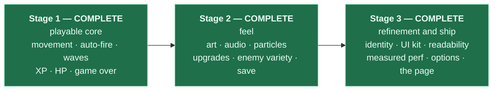

# Project status and upgrade paths

**This is the checkpoint document.** If you want to know what `arena` is today and what it
could become, read this and nothing else first. Whether you are a person returning after a
month or an agent picking up a task, start here.

| | |
|---|---|
| **Stage** | 3 of 3 — **complete**. **The project is finished.** There is no Stage 4 |
| **Next** | Nothing staged. Work after this point is maintenance: make it as a change, not as a stage |
| **Last verified** | 2026-08-15 |
| **Health** | `typecheck` ✅ · `lint` ✅ 0 warnings · `test` ✅ 153 passed / 11 files · `build` ✅ 0 warnings · **production** console ✅ empty |
| **Size** | 66 TypeScript files, ~5,900 lines excluding tests · 9 scenes |
| **Bundle** | 1,502.82 kB raw / **394.14 kB gzip**, one chunk, all of it Phaser |
| **Performance** | 59.9 fps mean at 220 enemies, 6.4 draw calls/frame, heap *shrinks* over 133 s. Measured in a production build — the numbers and the method are in [`AGENTS.md`](../AGENTS.md) |
| **Runtime dependencies** | `phaser@4.2.1`, `zod@4` — nothing else, across all three stages |
| **Assets** | None at runtime. Every frame is baked and every sound synthesised at boot — no images, no audio files, not even a favicon file. The three PNGs in the repo are README screenshots |
| **Deployed** | No — **by the owner's decision**, not for want of readiness. The build is deploy-ready, CI runs the four checks on every push, and the deployment documentation is [`deployment/`](deployment/README.md) |

> All three stages are done. The per-stage development record is [`version1/`](version1/README.md),
> [`version2/`](version2/README.md) and [`version3/`](version3/README.md).

---

## 1. What works today

Everything listed here is implemented, verified in a browser, and covered by the four checks.

| Feature | Behaviour | Owned by |
|---|---|---|
| **Movement** | WASD, normalised so diagonals aren't faster, clamped to the arena | `entities/Player.ts`, `components/Controls.ts` |
| **Auto-fire** | Targets the nearest enemy within range; holds fire when none is in range | `systems/CombatSystem.ts`, `components/Weapon.ts` |
| **Projectiles** | Pooled, travel at fixed speed, expire on a lifetime | `entities/Projectile.ts` |
| **Enemies** | Three types — grunt, swarmer, brute — as **definitions**, not classes. Walk in from a ring outside the arena, chase directly, no pathfinding | `data/enemies.json`, `entities/Enemy.ts`, `systems/CombatSystem.ts` |
| **Waves** | 15 waves, 40 spawn entries, JSON-driven with per-type and per-wave HP and speed multipliers | `data/waves.json`, `systems/SpawnSystem.ts` |
| **Victory** | Clearing wave 15 ends the run as a win, not a hang. The summary screen says so | `systems/CombatSystem.ts`, `scenes/GameOverScene.ts` |
| **Difficulty** | A real fail state. A stationary player dies in wave 3; the curve is tuned against the weapon's 37.5 dps clear rate | `data/waves.json` |
| **Damage** | Both directions. Enemy contact damage is on a per-enemy cooldown, not per frame | `systems/CombatSystem.ts`, `components/Health.ts` |
| **XP gems** | Drop on death, pulled in within magnet range, feed the level curve | `systems/PickupSystem.ts`, `entities/XpGem.ts` |
| **Health pickup** | One per wave from wave 5, at a random spot away from the player. Expires unclaimed | `systems/PickupSystem.ts`, `entities/HealthPickup.ts` |
| **Arena** | Floor, low-contrast grid, a lit wall and a vignette, composited into **one** `DynamicTexture` at boot — one draw call, not a per-frame `Graphics` rebuild | `scenes/PreloadScene.ts`, `ui/backdrop.ts` |
| **Spawn telegraph** | A marker at the arena edge before an enemy walks in, so an enemy behind you was announced | `entities/SpawnMarker.ts`, `systems/VfxSystem.ts` |
| **HUD** | Health that drains and flashes with the digits beside it, XP as progress toward the next level, `WAVE n / 15`, live level, and a running tally of upgrades taken. Still holds no reference into the run | `scenes/HUDScene.ts` |
| **UI kit** | Panel, label (7 roles), button, bar, upgrade card and list. Changing the accent colour is one edit in `balance.ts` | `src/ui/` |
| **Scene transitions** | Camera fades in both directions, 200–220 ms. No tween and no `TimerEvent` anywhere in the project, which is what makes pausing safe | `ui/transitions.ts` |
| **Animation** | Idle / walk / hit per actor, five frames each, baked at boot — in **both** palettes, because `setTint` multiplies and can only darken | `scenes/PreloadScene.ts`, `core/animKeys.ts`, `components/Animator.ts` |
| **Audio** | Six SFX and a two-voice music loop, all synthesised into WAV buffers at boot. Identical sounds inside 50 ms coalesce | `systems/AudioSystem.ts`, `core/audioSynth.ts` |
| **VFX** | Hit sparks, death bursts, pickup sparkles, heal burst, floating damage numbers, screen shake, damage flash — all under per-frame budgets, so forty deaths in one frame is not forty bursts | `systems/VfxSystem.ts`, `entities/FloatingText.ts` |
| **Readability at scale** | Enemies tint toward damage as they lose HP, so a nearly-dead brute reads as nearly dead at 200 enemies | `entities/Enemy.ts`, `core/color.ts` |
| **Game feel** | Knockback away from the shot; the whole simulation freezes 45 ms on a kill | `systems/CombatSystem.ts` |
| **Progression** | XP curve, levels, pick-1-of-3 upgrades over a paused game. Six upgrades, stack-capped and weighted; offers one or two when fewer than three remain rather than skipping the level | `systems/ProgressionSystem.ts`, `core/xpCurve.ts`, `scenes/UpgradeScene.ts` |
| **Stats** | Immutable bases plus modifiers, recomputed on every read. Removing a modifier restores the exact base | `core/StatBlock.ts`, `components/Stats.ts` |
| **Options** | Master / SFX / music volume, reduced motion, colourblind palette. Reachable from the menu and mid-run from pause, by mouse or keyboard | `scenes/OptionsScene.ts` |
| **Accessibility** | Reduced motion removes shake, flash and hit-stop and damps particle counts — it never removes information and never confers an advantage. The colourblind palette separates all three enemy types on luminance, which survives every deficiency | `systems/VfxSystem.ts`, `systems/CombatSystem.ts`, `scenes/PreloadScene.ts` |
| **Persistence** | High score, best wave, total runs **and every option**, in `localStorage`, versioned and zod-validated, with v1→v3 and v2→v3 migrations | `core/SaveStore.ts`, `platform/` |
| **Pause** | Escape freezes the run and layers a screen over it, still rendering | `scenes/PauseScene.ts` |
| **Run flow** | Menu → game → (level-ups, pauses, options) → death **or victory** → summary with records → restart | `scenes/` |
| **Content validation** | `waves.json`, `enemies.json` and `upgrades.json` are zod-validated at boot; malformed content crashes immediately with the exact failing path | `data/schema.ts` |
| **Restart safety** | Two consecutive restarts behave identically to one, verified by listener census | `scenes/GameScene.ts` |
| **The page** | Title, description, Open Graph tags, an inline-SVG favicon, a loading state before Phaser boots, and an error boundary that catches a failed boot instead of showing a black rectangle | `index.html` |

### Verified behaviours worth not regressing

These were established by measurement, not inspection. If you change the relevant code, re-check them.

- **Listener census across restarts.** Driving `run:ended` through the real path and reading
  `eventBus.listenerCount` gives an identical result every run, and all zeros between runs.
  Verified across two consecutive restarts. Measure it from a system's own `bus` field:
  importing `EventBus.ts` from devtools gets you a *second* module instance and a census that
  looks doubled.
- **A stationary player dies in wave 3**, with roughly 20 enemies alive. Measured in-browser.
- **59.9 fps mean over 7,959 frames at 220 enemies**, worst frame 17.6 ms, heap −8.5 MB over
  133 s. Production build. Method in `AGENTS.md`; reproduce with `BALANCE.debug.startWave = 8`.
- **Deleting `AudioSystem` and `VfxSystem`** from the array in `GameScene.create` leaves a
  playable, silent, unadorned game with identical timing.
- **Malformed content fails at boot**, in `PreloadScene`, naming the exact JSON path.
- **A v2 save migrates to v3 in a real browser**, not only in tests, and arrives with every
  accessibility option **off** — a migration must never switch one on for you.
- **The console stays empty** in the production build. Phaser's own version banner is the only
  line, and it is a `log`.

---

## 2. Known issues and rough edges

| # | Issue | Impact | Owner |
|---|---|---|---|
| 1 | **Toggling the colourblind palette mid-run repaints only enemies that spawn after it.** Each enemy picks its palette variant when it leaves the pool. | Cosmetic and self-correcting within a few seconds of play. Changing it from the menu is unaffected. | Fixable by re-targeting every live enemy's animator on `options:changed`; deliberately not done, because it adds a live-entity sweep to a system that otherwise only subscribes |
| 2 | **The "moves competently" difficulty band is still not systematically measured.** The owner has now played the Stage 3 build and reported on it, and waves 11–15 exist because of that; but the only *measured* difficulty fact remains the stationary-player death in wave 3. | Waves 11–15 were designed by curve extension, not by measured clear rate. They may be too easy or too hard for a good player. | Whoever plays it end-to-end and records what happened |
| 3 | **The game is not deployed.** `docs/STAGE_3_instructions.md` §7 asks for a URL in the README; §6 of the same file, edited later by the owner, says to prepare for deployment without deploying. The later instruction won. | The one line of Stage 3's definition of done that is deliberately unmet. Everything it depends on is done: the build is warning-free, the console is empty in production, the page has its metadata and error boundary, `vercel.json` and CI are committed, and the runbook is written. | The owner, when they want it public. [`deployment/`](deployment/README.md) is the documentation |
| 4 | **CI reports, it does not gate.** GitHub Actions runs the four checks on every push; Vercel's Git integration deploys on the same push. Neither waits for the other, and `vite build` does not typecheck — so a commit that fails `typecheck` can still be published. | Only matters once the project is actually deployed, and only for a direct push to the default branch. | Enable branch protection on `main` requiring the `checks` status. Two minutes, free on public repos — [`deployment/03-ci-cd.md`](deployment/03-ci-cd.md) covers the alternatives and why this is the right one |

None of these block play.

**Fixed and removed from this list:** the 20 tracked browser-test artefacts, cleared in a
standalone `chore(repo)` commit at the end of Stage 3 — `.playwright-mcp/` is now ignored and
the three PNGs that remain are README screenshots, kept on purpose.

---

## 3. The staging plan

This project was built in three stages **on purpose**, and building ahead of the current stage
was the failure mode this exercise existed to prevent.



**All three are done, and the staging is closed.** The rule that mattered most — never build
ahead of the current stage — now reads: **never reopen a stage that closed.** Section 4 is a
record of what was delivered and a map of what was deliberately never built. It is not a
backlog.

---

## 4. What each stage delivered

Each entry states what was built and — most usefully — **which architectural invariant it
stressed.** That last column is the real value: it says where the design actually bent.

### Stage 2 — feel and content — **all delivered 2026-08-14**

| Upgrade | Delivered | What it stressed, and what happened |
|---|---|---|
| **Data-driven enemies** | `enemies.json`; swarmer and brute as definitions. A fourth type is two JSON edits | "Content is data" held. Two one-time scene edits were needed — `PreloadScene` (predicted) and `GameScene` (not) |
| **Per-frame textures + animations** | Five baked frames per actor, twelve animations, `Animator`. No atlas | Nothing structural, as expected. The frame array names its own texture per frame, so separately baked squares compose fine |
| **Audio** | Six SFX and a music loop, synthesised at boot into WAV buffers | "Presentation is event-driven" held: `AudioSystem` only subscribes. Phaser unlocks the context itself — the manual unlock the brief called for was wrong |
| **VFX** | Three emitters, pooled floating text, shake, flash | Pooling held. Emitters are built once in the constructor and re-triggered with `explode(count, x, y)` |
| **Game feel** | Knockback and hit-stop, both in `CombatSystem` | The gameplay/presentation line held, and sharpened: hit-stop needed the scene to pause the *physics world*, because skipping systems alone still lets Phaser step every body |
| **Progression** | XP curve, levels, six weighted upgrades, `UpgradeScene` over a paused game | "Stats are computed, never mutated" held, and forced a real change: `Weapon` gave up its damage/cooldown/range fields and became a pure timer |
| **Persistence** | Versioned `SaveStore` with an injected adapter and a v1→v2 migration | "`core/` imports nothing" held. Tested against a `Map` in bare Node, including quota-exceeded and corrupt JSON |
| **Pause + upgrade scenes** | `PauseScene` and `UpgradeScene`, both layered over `scene.pause()` | Scene lifecycle held trivially, because the game owns no `TimerEvent` and no tween — every clock is a number decremented by `dt` |

Full brief and per-feature ledger: [`STAGE_2_INSTRUCTIONS.md`](STAGE_2_INSTRUCTIONS.md).
History: [`version2/`](version2/README.md).

### Stage 3 — refinement and ship — **all delivered 2026-08-15**

| Pass | Delivered | What it stressed, and what happened |
|---|---|---|
| **A — identity** | One `PALETTE` every colour references; arena floor, grid, wall, vignette and spawn telegraph | "Zero magic numbers" extended to colours cleanly. The trap was Phaser's: `generateTexture` renders through the *Canvas* API and silently drops `fillGradientStyle`, so the whole arena had to be composited in a `DynamicTexture` instead |
| **B — the UI kit** | `src/ui/`, six widgets, all five screens rebuilt on them, camera-fade transitions, a HUD that reacts | Invariant 3 held under pressure: the HUD needed the level, the wave count and the upgrade tally, and got all three as bus events rather than a reference. It required a new folder — `components/` is behaviour attached to *entities*, and a widget is neither |
| **C — readability** | Damage tinting, per-frame effect budgets, three distinguishable moments | This is the pass that most wanted to become gameplay, and did not. Tinting an enemy is presentation; slowing a hurt one is not |
| **G — the owner's addendum** | Waves 11–15, a victory condition, a health pickup, a live level readout | **Out of Stage 3's scope, and separated for exactly that reason** — a later pass and its own commit, so the evidence that the polish passes changed no gameplay stays mechanically checkable. See invariant 16 |
| **D — performance** | The budget measured for the first time since Stage 1 — and **three optimisations declined on the evidence** | The most valuable pass in the stage, and it changed no code. The atlas Stage 2 deferred as "a Stage 3 problem" turned out not to be a problem: 220 sprites cost 6–10 draw calls |
| **E — options** | Volumes, reduced motion, a colourblind palette, all persisted through the existing save | Invariant 15's migration path had never been used; this was the first thing to use it, and it worked. `setTint` multiplies — it can darken but never brighten — so the colourblind variant is *baked*, not re-tinted |
| **F — ship** | Error boundary, loading state, metadata, inline-SVG favicon, small-viewport check, docs closed out | The asset-free rule survived to the last file: the favicon is an inline SVG data URI, so the game still makes zero asset requests |

Full brief: [`STAGE_3_instructions.md`](STAGE_3_instructions.md). History, including everything
that went wrong: [`version3/`](version3/README.md).

### Never built, and permanently out

Recorded so that "why isn't there X?" has an answer, and so nobody mistakes this list for a
backlog.

| Not built | Why |
|---|---|
| **Engine-free simulation, `packages/sim`, determinism, replay, server-validated scores** | An earlier Stage 3 was exactly this and was cancelled deliberately: the project ships as a game, not as an architecture proof. `STAGE_3_instructions.md` §2 records the reasoning *and* the cost. Recoverable from `git log` if a future project wants it |
| **ECS, worker pathfinding, arena obstacles, level editor, backend leaderboard** | All downstream of the sim/view split above |
| Multiple weapons · boss enemies · new enemy types | Content was finished at Stage 2, and the curve is tuned against what exists |
| Mobile touch controls · i18n · achievements · online multiplayer | Never planned, still not planned |

**Removed from this list in Stage 3: the settings menu.** Both earlier stages listed it under
"explicitly not planned", which was correct while there was nothing to configure. Stage 2 then
shipped three volume fields with no UI able to reach them, and a game that cannot be muted is
not shippable. Pass E reversed the decision on purpose, and this sentence exists so the
reversal is visible rather than quietly assumed.

---

## 5. For AI agents

If you are an agent picking up work on this project, this section is your entry point.

**The project is finished.** All three stages are closed and there is no Stage 4. That does not
mean nothing may change — it means a change is a change, made on its own merits, and not a
stage. Do not reopen a closed stage, and do not add "Stage 4" to any document.

### Before writing any code

1. Read [`AGENTS.md`](../AGENTS.md) **in full.** It is the authority on stack, structure and
   invariants — now 1–20. If any other document, including this one, contradicts it, it wins.
2. Read [`ARCHITECTURE.md`](../ARCHITECTURE.md) for the frame pipeline, the event catalogue and
   the "which file do I touch" table.
3. Read the files you intend to change. Do not plan against remembered contents.
4. Confirm the baseline is green before starting:
   ```bash
   npm run typecheck && npm run lint && npm run test && npm run build
   ```
   If any fail, stop and report. Do not begin work on a broken baseline.

### The rules most likely to get work rejected

| Rule | Why it exists |
|---|---|
| **`src/core/**` must never import Phaser** | Lint-enforced. It keeps the tricky logic testable without a browser |
| **No numbers outside `constants/balance.ts`** | Includes colours and sizes — invariants 5 and 17 |
| **No hex literal outside `BALANCE.palette`** | It is what made a colourblind mode an edit instead of a sweep |
| **Scenes compose widgets from `src/ui/`; they do not call `this.add.text()`** | A scene that bypasses the kit is the one the next restyle misses |
| **No `new` in any `update()` path** | Allocation causes GC pauses, which are visible stutters |
| **`dt` is seconds, converted once** | Phaser gives milliseconds; the conversion happens in `GameScene.update()` — and in `HUDScene`, which runs while the game is paused and therefore owns the only other one |
| **No `any`, no `@ts-ignore`** | If Phaser's types fight you, write a narrow typed wrapper and comment why |
| **Every scene cleans up on `SHUTDOWN`** | Test by restarting **twice**, not once |
| **No performance change without a before/after number** | Invariant 20. A measured negative result is a successful outcome |
| **Named exports only, one class per file** | |

### Phaser 4, not Phaser 3

Your training data is overwhelmingly Phaser 3, and v4 is a rewrite. Assume your recall is
stale and verify before writing:

- `node_modules/phaser/skills/` ships subsystem documentation for exactly this purpose — **28
  skill files** covering physics, scenes, particles, input, audio, animations, cameras,
  tweens, render textures and more, plus `v3-to-v4-migration` and `v4-new-features`. **Read
  the relevant one before touching an unfamiliar subsystem.** There is no `blitter` skill; if
  you need `Blitter`, confirm it still exists in `node_modules/phaser/types/` first.
- `node_modules/phaser/types/phaser.d.ts` is the ground truth when a skill and your memory
  disagree.
- Known v4 differences already hit in this project: `import * as Phaser from 'phaser'` (no
  default export); `Create.GenerateTexture` and `TextureManager.generate` are **removed**
  (but `Graphics#generateTexture` survives and is what bakes most of the art); the v3 pipeline
  system is gone; `Geom.Point` is replaced by `Vector2`; `Math.TAU` changed meaning.

### Four traps this project has already fallen into

Recorded so nobody pays for them twice.

**Phaser tears down its own plugins before your `SHUTDOWN` handler runs.** By the time the
handler fires, the Arcade Physics plugin has released every body, so `sprite.body` is
`undefined`. Anything in teardown that touches a body must guard first. This threw mid-handler
and silently skipped the rest of the cleanup — which was itself the bug the cleanup existed to
prevent.

**`as const` objects produce literal types.** A class field initialised from `BALANCE` infers
the literal (`62`), not `number`, and then rejects every other value. Annotate the field
explicitly. The same trap bites the *linter*: `for (let x = 0; x < BALANCE.world.width; …)`
compares a literal against a literal, which is a constant condition and correctly rejected.

**`Graphics#generateTexture` renders through the Canvas API, not WebGL.** It therefore
silently drops `fillGradientStyle` — you get a flat fill and no error. Anything with a
gradient has to be composited into a `DynamicTexture` instead. Stage 3's arena vignette and
wall glow are the reason this is known.

**`setTint` multiplies.** It can darken a baked texture and can never brighten one, so a
palette variant cannot be implemented by tinting the default art. Stage 3 bakes both palettes
at boot, which costs three extra textures and works.

### Definition of done

A change is not done until **all four** pass, and the game runs with an empty browser console:

```bash
npm run typecheck && npm run lint && npm run test && npm run build
```

"It compiles" is not done. "It renders" is not done. Then report: files changed with a
one-line reason each, the verification output, and anything noticed but deliberately left
alone.

---

## 6. Keeping these documents true

Stale documentation is worse than none, because it will be trusted. The defence is that
**every fact lives in exactly one file.** If you find the same fact in two, delete one and
link instead.

| Document | Owns | Update it when |
|---|---|---|
| [`README.md`](../README.md) | Quickstart, commands, the map of documents | Commands change, or a document is added or removed |
| [`docs/ONBOARDING.md`](ONBOARDING.md) | Game-development concepts for newcomers | A concept changes shape — rare. Not a changelog |
| **`docs/STATUS.md`** (this file) | Current state, known issues, what each stage delivered, agent entry point | A feature lands, or an issue is found or fixed |
| [`ARCHITECTURE.md`](../ARCHITECTURE.md) | Scene lifecycle, system contract, event catalogue, "which file do I touch" | Architecture changes — **in the same commit** |
| [`AGENTS.md`](../AGENTS.md) | Stack, structure, invariants 1–20, code style, the measured performance budget | A convention is established or changed |
| [`CLAUDE.md`](../CLAUDE.md) | How humans and agents collaborate here | Working practice changes, not code |
| [`docs/STAGE_2_INSTRUCTIONS.md`](STAGE_2_INSTRUCTIONS.md), [`docs/STAGE_3_instructions.md`](STAGE_3_instructions.md) | The stage briefs — **historical now that both stages are closed** | Never. They record what was asked for |
| [`docs/KICKSTART.md`](KICKSTART.md) | The original Stage 1 scaffold prompt — **historical** | Never. It is a record of what was asked for, not of what shipped |
| [`docs/deployment/`](deployment/README.md) | How a commit becomes a URL: the `vercel.json` / Docker / CI decisions, the Vercel deployment logic, the pipeline | Operational and **current**. Update it when the hosting, the pipeline or the build settings change |
| [`docs/version1/`](version1/README.md), [`version2/`](version2/README.md), [`version3/`](version3/README.md) | The development record, one folder per stage: decisions, rationale, difficulties, lessons | Written at the end of a stage, from what happened. Never edited afterwards except to correct an error. **All three are written; none of them should change again** |

### The checklist when something lands

1. Add or amend a row in **§1 What works today**, naming the file that owns it.
2. Remove anything it fixes from **§2 Known issues**.
3. Update the **snapshot table** at the top — verification date, file count, bundle size.
4. If it changed architecture, update `ARCHITECTURE.md` **in the same commit**.
5. If it established a convention, add it to `AGENTS.md`.
6. If it added an event, add it to the catalogue in `ARCHITECTURE.md` — not here.
7. If it changed performance, put the before/after number in the commit message (invariant 20).

### What must never go in these documents

Anything a fresh session could reconstruct by reading the repo: directory listings, dependency
lists that duplicate `package.json`, command signatures copied from source, or architecture
tours that restate what the code already says. Documentation earns its place by holding what
the code *cannot* say — the reasons, the traps, and the decisions that were deliberate.
