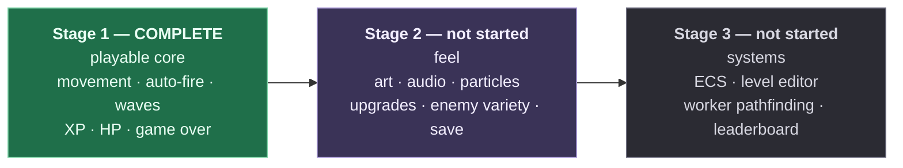

# Project status and upgrade paths

**This is the checkpoint document.** If you want to know what `arena` is today and what it
could become, read this and nothing else first. Whether you are a person returning after a
month or an agent picking up a task, start here.

| | |
|---|---|
| **Stage** | 1 of 3 — **complete** |
| **Last verified** | 2026-08-14 |
| **Health** | `typecheck` ✅ · `lint` ✅ 0 warnings · `test` ✅ 50 passed · `build` ✅ 0 warnings · browser console ✅ empty |
| **Size** | 31 TypeScript files, ~2,100 lines |
| **Runtime dependencies** | `phaser@4.2.1`, `zod@4` — nothing else |
| **Assets** | None. All art is coloured rectangles generated at boot |

---

## 1. What works today

Everything listed here is implemented, verified in a browser, and covered by the four checks.

| Feature | Behaviour | Owned by |
|---|---|---|
| **Movement** | WASD, normalised so diagonals aren't faster, clamped to the arena | `entities/Player.ts`, `components/Controls.ts` |
| **Auto-fire** | Targets the nearest enemy within range; holds fire when none is in range | `systems/CombatSystem.ts`, `components/Weapon.ts` |
| **Projectiles** | Pooled, travel at fixed speed, expire on a lifetime | `entities/Projectile.ts` |
| **Enemies** | One type. Walk in from a ring outside the arena, chase directly, no pathfinding | `entities/Enemy.ts`, `systems/CombatSystem.ts` |
| **Waves** | 5 waves, 7 spawn entries, JSON-driven with per-wave HP and speed multipliers. Holds on the final wave | `data/waves.json`, `systems/SpawnSystem.ts` |
| **Damage** | Both directions. Enemy contact damage is on a per-enemy cooldown, not per frame | `systems/CombatSystem.ts`, `components/Health.ts` |
| **XP gems** | Drop on death, pulled in within magnet range, increment a counter | `systems/PickupSystem.ts`, `entities/XpGem.ts` |
| **HUD** | Health bar, wave counter, XP counter — in a parallel scene holding no game references | `scenes/HUDScene.ts` |
| **Run flow** | Menu → game → death → summary → restart | `scenes/` |
| **Content validation** | `waves.json` is zod-validated at boot; malformed content crashes immediately with the exact failing path | `data/schema.ts` |
| **Restart safety** | Two consecutive restarts behave identically to one, verified by listener census | `scenes/GameScene.ts` |

### Verified behaviours worth not regressing

These were established by measurement, not inspection. If you change the relevant code, re-check them.

- **Listener census across restarts.** Driving `run:ended` through the real path and reading
  `eventBus.listenerCount` gives an identical result every run — `player:health-changed` 1,
  `wave:started` 2, `xp:changed` 2, `enemy:died` 1, `run:ended` 1 — and all zeros between runs.
- **Malformed content fails at boot**, in `PreloadScene`, naming the exact JSON path.
- **The console stays empty.** No errors, no warnings, no stray `console.log`.

---

## 2. Known issues and rough edges

| # | Issue | Impact | Suggested owner |
|---|---|---|---|
| 1 | **Difficulty plateaus.** Standing completely still, the player does not die. Auto-fire clears the swarm at roughly the rate it spawns (~37 dps against enemies arriving one per 0.6s from ~640px out), so almost nothing reaches contact range. | The game has no real fail state yet. Any upgrade or XP-curve tuning would be balanced against a difficulty ramp that does not exist. | Stage 2 Pass C, or a standalone balance pass |
| 2 | `docs/CURRENT_ISSUE.md` describes a bug that is fixed. | Actively misleading — it says the game shows a black screen. | Delete it |
| 3 | ~20 browser-test screenshots (`.playwright-mcp/`, `menu.png`) are tracked in git. | Repo noise. | `git rm -r --cached .playwright-mcp menu.png` and add to `.gitignore` |
| 4 | No `EnemyDefinition` abstraction yet — `Enemy` takes loose `(maxHp, speed)` arguments. | Fine for one enemy type; the first thing Stage 2 Pass A changes. | Stage 2 Pass A |

None of these block play.

---

## 3. The staging plan

This project is built in three stages **on purpose**, and building ahead of the current stage
is the failure mode this exercise exists to prevent.



> **Listing an upgrade in this document is not permission to build it.** Section 4 is a map of
> where the project *could* go, so that a design decision made today can be checked against
> tomorrow. It is not a backlog to work through. The current stage is the one named at the top
> of [`ARCHITECTURE.md`](../ARCHITECTURE.md), and that file is the authority.

---

## 4. Upgrade catalogue

Each entry states what it adds, which files it touches, and — most usefully — **which
architectural invariant it stresses.** That last column is the real value: it tells you in
advance where the design is likely to bend.

Effort is rough: **S** ≈ under an hour, **M** ≈ a focused session, **L** ≈ multiple sessions.

### Stage 2 — feel and content

| Upgrade | What it adds | Touches | Stresses | Effort |
|---|---|---|---|---|
| **Data-driven enemies** | `enemies.json`; swarmer and brute as *definitions*, not new classes | `data/`, `entities/Enemy.ts`, `scenes/PreloadScene.ts`, `systems/SpawnSystem.ts` | "Content is data" — proves a new enemy costs zero code | **M** |
| **Texture atlas + animations** | Replaces baked rectangles with a packed atlas; idle/walk/hit states | `scenes/PreloadScene.ts`, new `components/Animator.ts`, `constants/keys.ts` | Nothing structural — mostly a preload change | **M** |
| **Audio** | SFX for shoot/hit/death/pickup, one music loop, volume control | New `systems/AudioSystem.ts` | "Presentation is event-driven" — audio may only *subscribe*, never be called by gameplay | **M** |
| **VFX** | Hit sparks, death bursts, floating damage numbers | New `systems/VfxSystem.ts`, new `entities/FloatingText.ts` | Pooling — emitters must be created once at init, never per hit | **M** |
| **Game feel** | Screen shake, damage flash, knockback, hit-stop | `systems/CombatSystem.ts` (knockback, hit-stop) and `VfxSystem` (shake, flash) | The gameplay/presentation line — knockback and hit-stop move things, so they are **not** presentation | **S** |
| **Progression** | XP curve, levels, pick-1-of-3 upgrade offers, stat modifiers | New `core/xpCurve.ts`, `core/StatBlock.ts`, `components/Stats.ts`, `systems/ProgressionSystem.ts` | "Stats are computed, never mutated" — add/remove a modifier must restore the exact base value | **L** |
| **Persistence** | Versioned, schema-validated localStorage save | New `core/SaveStore.ts` | "`core/` imports nothing" — storage must arrive as an injected adapter so it tests without a browser | **M** |
| **Pause + upgrade scenes** | Scenes layered over a paused `GameScene` | New `scenes/PauseScene.ts`, `scenes/UpgradeScene.ts` | Scene lifecycle — a paused scene's timers must not fire | **M** |

Full brief, with corrections applied against the shipped code:
[`STAGE_2_INSTRUCTIONS.md`](STAGE_2_INSTRUCTIONS.md).

### Stage 3 — systems

| Upgrade | What it adds | Stresses | Effort |
|---|---|---|---|
| **ECS refactor** | Replaces entity classes with component arrays | Everything. This is the stage that tests whether Stage 1's boundaries were drawn correctly | **L** |
| **Level editor** | In-browser arena authoring, exported as JSON | "Content is data" taken to its conclusion | **L** |
| **Worker pathfinding** | Real navigation off the main thread | The frame budget, and the fact that `core/` is portable enough to run in a worker | **L** |
| **Backend leaderboard** | Server-side score submission | The first network boundary in the project | **L** |

### Explicitly not planned

Multiple weapons · boss enemies · mobile controls · settings menu · achievements · i18n ·
online multiplayer.

These are listed so that "why isn't there a settings menu?" has an answer. Adding one is a
scope decision, not an oversight.

---

## 5. For AI agents

If you are an agent picking up work on this project, this section is your entry point.

### Before writing any code

1. Read [`AGENTS.md`](../AGENTS.md) **in full.** It is the authority on stack, structure and
   invariants. If any other document — including this one — contradicts it, it wins.
2. Read [`ARCHITECTURE.md`](../ARCHITECTURE.md) to find the **current stage** and the "which
   file do I touch" table.
3. Read the files you intend to change. Do not plan against remembered contents.
4. Confirm the baseline is green before starting:
   ```bash
   npm run typecheck && npm run lint && npm run test && npm run build
   ```
   If any fail, stop and report. Do not begin work on a broken baseline.

### The rules most likely to get work rejected

| Rule | Why it exists |
|---|---|
| **Never build ahead of the current stage** — not even a stub, a TODO hook, or an optional field "so the next stage is easier" | The staging *is* the exercise. This is the failure mode that matters most |
| **`src/core/**` must never import Phaser** | Lint-enforced. It keeps the tricky logic testable without a browser |
| **No numbers outside `constants/balance.ts`** | Includes colours and sizes |
| **No `new` in any `update()` path** | Allocation causes GC pauses, which are visible stutters |
| **`dt` is seconds, converted once** | Phaser gives milliseconds; the conversion happens only in `GameScene.update()` |
| **No `any`, no `@ts-ignore`** | If Phaser's types fight you, write a narrow typed wrapper and comment why |
| **Every scene cleans up on `SHUTDOWN`** | Test by restarting **twice**, not once |
| **Named exports only, one class per file** | |

### Phaser 4, not Phaser 3

Your training data is overwhelmingly Phaser 3, and v4 is a rewrite. Assume your recall is
stale and verify before writing:

- `node_modules/phaser/skills/` ships subsystem documentation for exactly this purpose — 36
  skill files covering physics, scenes, particles, input, audio and more. **Read the relevant
  one before touching an unfamiliar subsystem.**
- `node_modules/phaser/types/phaser.d.ts` is the ground truth when a skill and your memory
  disagree.
- Known v4 differences already hit in this project: `import * as Phaser from 'phaser'` (no
  default export); `Create.GenerateTexture` and `TextureManager.generate` are **removed**
  (but `Graphics#generateTexture` survives and is what bakes the Stage 1 art); the v3 pipeline
  system is gone; `Geom.Point` is replaced by `Vector2`; `Math.TAU` changed meaning.

### Two traps this project has already fallen into

Recorded so nobody pays for them twice.

**Phaser tears down its own plugins before your `SHUTDOWN` handler runs.** By the time the
handler fires, the Arcade Physics plugin has released every body, so `sprite.body` is
`undefined`. Anything in teardown that touches a body must guard first. This threw mid-handler
and silently skipped the rest of the cleanup — which was itself the bug the cleanup existed to
prevent.

**`as const` objects produce literal types.** A class field initialised from `BALANCE` infers
the literal (`62`), not `number`, and then rejects every other value. Annotate the field
explicitly.

### Definition of done

A change is not done until **all four** pass, and the game runs with an empty browser console:

```bash
npm run typecheck && npm run lint && npm run test && npm run build
```

"It compiles" is not done. "It renders" is not done. Then report: files changed with a
one-line reason each, the verification output, and anything noticed but deliberately left
alone.

---

## 6. Keeping these documents true

Stale documentation is worse than none, because it will be trusted. The defence is that
**every fact lives in exactly one file.** If you find the same fact in two, delete one and
link instead.

| Document | Owns | Update it when |
|---|---|---|
| [`README.md`](../README.md) | Quickstart, commands, the map of documents | Commands change, or a document is added or removed |
| [`docs/ONBOARDING.md`](ONBOARDING.md) | Game-development concepts for newcomers | A concept changes shape — rare. Not a changelog |
| **`docs/STATUS.md`** (this file) | Current state, known issues, roadmap, agent entry point | A feature lands, a stage completes, or an issue is found or fixed |
| [`ARCHITECTURE.md`](../ARCHITECTURE.md) | Scene lifecycle, system contract, event catalogue, "which file do I touch" | Architecture changes — **in the same commit** |
| [`AGENTS.md`](../AGENTS.md) | Stack, structure, invariants, code style | A convention is established or changed |
| [`CLAUDE.md`](../CLAUDE.md) | How humans and agents collaborate here | Working practice changes, not code |

### The checklist when a feature lands

1. Add a row to **§1 What works today**, naming the file that owns it.
2. Remove anything it fixes from **§2 Known issues**.
3. Move its entry out of **§4 Upgrade catalogue**.
4. Update the **snapshot table** at the top — stage, verification date, file count.
5. If it changed architecture, update `ARCHITECTURE.md` **in the same commit**.
6. If it established a convention, add it to `AGENTS.md`.
7. If it added an event, add it to the catalogue in `ARCHITECTURE.md` — not here.

### What must never go in these documents

Anything a fresh session could reconstruct by reading the repo: directory listings, dependency
lists that duplicate `package.json`, command signatures copied from source, or architecture
tours that restate what the code already says. Documentation earns its place by holding what
the code *cannot* say — the reasons, the traps, and the decisions that were deliberate.
