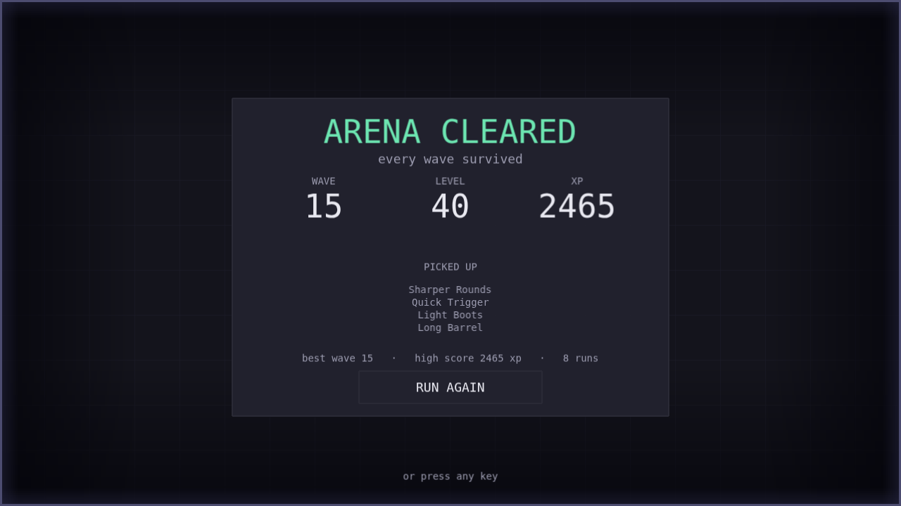

# Pass G — the owner's addendum

**This pass is not in the brief.** It is gameplay, in a stage whose defining invariant is that
it changes no gameplay. It exists because the project's owner played the Pass C build and asked
for it, and it is written up separately for exactly that reason.

Commit: `feat(game): fifteen waves, a victory, and a health pickup`.

---

## What was asked for

Five observations, from actually playing the game rather than reading it:

1. *"there is no level after 22"*
2. *"after surviving wave 10 the game stops and no victory sign or no next wave"*
3. *"how many boost i have gained and what boost i have lost when i got hit — there is no
   history showing me that stats"*
4. *"how many hit life i have left"*
5. *"some random block which will be somewhat different than other blocks will come once per
   wave after wave 5 to give me life; if I did not claim it after some time it vanishes"*

Plus: *"there will be 15 waves."*

---

## The correction that had to be made first

**Nothing in this game removes upgrades when you are hit.** The third observation describes a
mechanic that does not exist — a hit costs HP and nothing else. There is no upgrade loss, no
stack decay, no penalty beyond damage.

So the request could not be implemented as stated, and the useful part of it was real: the
player could not see *what they had taken*. The HUD gained a `PICKED UP` tally that lists every
upgrade as it is chosen, and the game over screen shows the same list.

Saying this plainly mattered more than building something. Implementing "show me what I lost"
by inventing a loss mechanic would have added a feature nobody asked for, on the strength of a
misremembered rule.

---

## Why it was quarantined rather than blended in

Invariant 16 is the whole discipline of Stage 3, and Stage 3's definition of done makes it
mechanically checkable:

> `git diff` against the Stage 2 tag shows no change to `waves.json`, no change to
> `enemies.json`, and no change to an existing gameplay value in `balance.ts`.

Five new waves obviously breaks that. Three options existed:

1. **Refuse.** Wrong: the owner sets scope, and they had played the game and formed a view.
2. **Fold it into the polish passes.** Wrong in a subtler and more damaging way: it would have
   destroyed the evidence that the rest of the stage held. A reviewer diffing `waves.json`
   would find changes and have no way to tell which pass made them or why.
3. **Build it as its own pass, after the polish passes, in its own commit.** This.

The result is that both facts stay checkable:

```
git diff <stage-2>..<pass-C>  -- src/data/  →  no change at all
git diff <stage-2>..<pass-G>  -- src/data/waves.json  →  40 insertions, 0 deletions
```

Ten waves untouched, five appended. `enemies.json` and `upgrades.json` untouched entirely. Not
one existing gameplay number in `balance.ts` changed; the additions are the health pickup's own
block and presentation keys.

**An owner changing scope is a decision. An agent quietly widening it is the failure this
project exists to teach.** That sentence is now invariant 16's recorded exception in
`AGENTS.md`, so the next reader finds it before they find the diff.

---

## What was built

### Waves 11–15

Appended by extending the existing curve rather than by re-tuning it — the tuning is Stage 2's
measured work and re-deriving it would have thrown that away. Wave 15 is 60 seconds, 130 grunts
at 4.4× HP, 200 swarmers at 2.4×, and 24 brutes at 3.6×.

Every spawn schedule was checked to fit inside its own wave duration: `count × intervalSeconds`
must not exceed `durationSeconds`, or the wave ends with enemies still queued and the last of
them never arrive. That is an arithmetic property of the data, easy to get wrong by eye, and
it is why the counts look uneven.

### A victory

Before this, clearing wave 10 left the game running with nothing left to fight — the state the
owner described as *"the game stops"*.

The flow is split across two systems, deliberately:

- `SpawnSystem` emits **`waves:cleared`** when every wave has been announced and every spawn
  issued. That is *not* the end of the run: the last enemies are still walking in.
- `CombatSystem` owns the decision, because it owns the deaths. It waits for
  `enemies.activeCount === 0` and then ends the run with a `victory` flag.

`run:ended` gained that third parameter, which is why the game over screen can say *you won*
rather than *you died*, and why its empty-upgrade-state text had to change too.



### A health pickup

A cross — every other object in this game is a square, so the shape is what identifies it, and
the colour is the second cue rather than the only one. It appears once per wave from **wave 6**,
six seconds in, and gives 25 HP.

Design decisions worth recording:

- **It expires after 10 seconds and blinks for the last 3.5.** The owner asked for the
  vanishing; the blink is the part that makes it fair. A pickup that disappears silently reads
  as a bug.
- **It spawns at least 190 px from the player**, by rejection sampling with a fixed attempt
  count. It should never be collectable by standing still, and a `while` loop looking for a
  valid point is an unbounded loop in a frame.
- **It keeps 96 px off the wall**, where the vignette would half-hide it.
- **It has its own depth**, `HEALTH_PICKUP: 35`, between enemy and player. At the projectile
  depth it was buried under the crowd at wave 8 — visible in isolation, invisible in the
  situation where it matters.
- **The timings are fixed, not random.** The player learns the rhythm, which turns the pickup
  into a decision — break off and get it, or keep killing — rather than a surprise.

### The level fix

Covered in [Pass B](03-pass-b-ui-kit-and-scenes.md): the HUD painted the level only on
`level:up`, and `ProgressionSystem` skipped the level entirely when fewer than three upgrades
remained uncapped. The second is a genuine Stage 2 design fault that only appears in a long
run, and long runs are exactly what waves 11–15 create.
