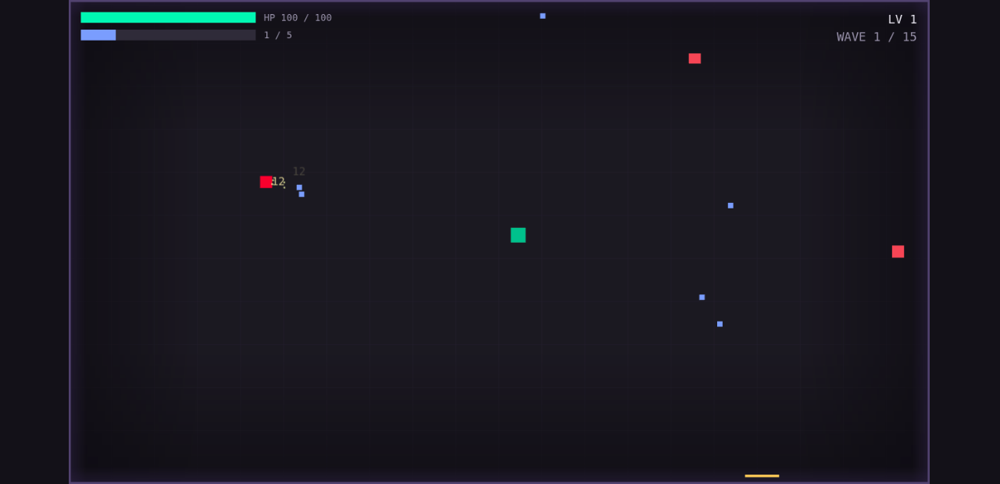

# Pass F — ship

The last pass in the project.

Everything before it made the game good. This one makes it a *thing on a page* rather than a
canvas that appears if nothing goes wrong.

---

## The error boundary is the point of this pass

If the boot sequence throws — malformed JSON, a texture bake that fails, WebGL unavailable —
the player got a black rectangle and a console they will never open.

`index.html` now carries a small inline script, deliberately **not** a module, that:

- listens for `error` and `unhandledrejection` and renders a plain "something went wrong" state
  with the error *message* (not a stack: enough for a bug report, useless as noise);
- watches `#game` with a `MutationObserver` and removes the loading overlay the moment a
  `<canvas>` appears — **the canvas appearing is the only honest signal that boot succeeded**,
  because Phaser creates it once the renderer is up, which is after the module graph has parsed
  and run;
- falls back to a 20-second timeout, because a module that never executes fires no error event
  of its own and none of the handlers above would ever run.

It is inline and classic-script rather than part of the bundle for the obvious reason: it has
to work when the bundle is what failed.

This is the one place in the project where a user-facing error string is worth writing, and it
says what to do ("reloading usually fixes it; if it does not, your browser may not support
WebGL") rather than what happened.

---

## The page around the game

`index.html` was Stage 1's placeholder — `<title>arena</title>`, an empty-data-URI favicon, no
description, no Open Graph tags, no loading state. It now has a title, a description, OG and
Twitter card tags, `theme-color`, `color-scheme`, a `<noscript>`, and a loading overlay that
shows `ARENA / loading…` while the module graph parses.

**The favicon is an inline SVG data URI** — the player's own square, in the player's own
colour, on the arena's backdrop. This is the asset-free rule surviving to the very last file:
a favicon *file* would have been the only asset request the game makes, and a 404 for a missing
one would have been the only failed request. The repo ships zero runtime assets across all
three stages.

The backdrop colour is repeated as a literal in the page's CSS. That is invariant 17's second
recorded exception and it is unavoidable — the page has to paint before any JavaScript runs.

---

## Build and scale check

- `npm run build` — warning-free. 1,502.82 kB raw, **394.14 kB gzip**, one chunk.
- `npm run preview` — played end to end, menu → run → level-up → pause → options → death →
  summary → restart. Console empty except Phaser's own version banner, which is a `log`.
- **Small-viewport check.** The config is `Scale.FIT` with `CENTER_BOTH` and had never been
  checked against a laptop-sized window. Verified at 1280×620, 1024×768 and 860×560 — a short
  window, a 4:3 one and a small one. It letterboxes correctly: the arena keeps its aspect
  ratio, centres, and the backdrop fills the bars — which works because the backdrop colour and
  the page background are the same palette entry, so the letterbox is invisible rather than
  black-on-dark-blue.

  

---

## What "ship" turned out to mean

The brief's Pass F step 5 says **"Deploy. Static host. Record the URL in `README.md`"**, and
§10 makes the deployed URL part of the definition of done.

**§6 of the same document, edited by the owner partway through the stage, says the opposite:**

> *Deploy target is a static host **but no deploying — just prepare the project to be deploy
> ready** (Vercel, Netlify, GitHub Pages, itch.io)*

The later, more specific instruction won. So Pass F did everything deployment depends on and
stopped at the last step:

| Asked for | Done |
|---|---|
| Production hardening | ✅ |
| The page around the game | ✅ |
| A real favicon | ✅ |
| Warning-free build, empty production console, scale check | ✅ |
| A deploy runbook | ✅ [`deployment.md`](deployment.md) |
| **A live URL in the README** | ❌ **deliberately not done — the owner's call** |

The gap is recorded in [`../STATUS.md`](../STATUS.md) §2 as issue 3 rather than quietly
dropped, because the brief's definition of done is a document someone will check this against.
A definition of done that was overruled by the person it belongs to is not a failure; a
definition of done that was silently ignored would be.

Everything the deploy needs exists. `npm run build` emits static files, the game has no
backend, no environment variables and no server-side anything. The runbook covers all four
hosts the brief named, including the one real trap — **GitHub Pages serves from a subpath and
Vite's default `base: '/'` breaks there**, which is a one-line config change that must *not* be
made pre-emptively because it breaks the other three.

---

## Closing the documentation

The last thing a stage does, and the thing most likely to be skipped because the project is
finishing:

- **`AGENTS.md`** — invariants 16–20, the stage table marked complete, `src/ui/` and
  `src/platform/` in the directory map, and the performance budget rewritten against Pass D's
  measured numbers with its method and environment.
- **`ARCHITECTURE.md`** — current stage → Stage 3 complete, the full event catalogue including
  every Stage 3 event, the scene lifecycle with `OptionsScene`, the HUD's second `dt`
  conversion, and new "which file do I touch" rows for *change how the game looks* and *add a
  UI widget*.
- **`docs/STATUS.md`** — per its own §6 checklist, with all three stages green in the mermaid
  diagram and the settings menu removed from "explicitly not planned".
- **`README.md`** — screenshots, the docs map, and the deployment position stated rather than
  implied.
- **`docs/version3/`** — this folder, written from what happened.

And a `chore(repo)` commit clearing the 20 tracked browser-test artefacts that had been
`STATUS.md`'s known issue 1 since Stage 2 — standalone, not mixed into a feature commit.
